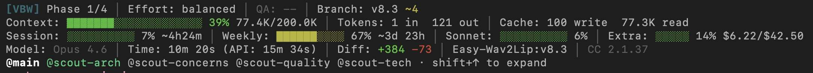

<div align="center">

# Vibe Better With Claude Code (Opus 4.6+) - YOLO

_You're not an engineer anymore. You're a prompt jockey with commit access. At least do it properly._

<br>


<br>

[](LICENSE)
[](https://code.claude.com)
[](https://anthropic.com)
[](https://discord.gg/zh6pV53SaP)

</div>

<br>

## Token Efficiency vs Stock Opus 4.6 Agent Teams

Native Rust CLI handles hooks, commands, and validation at zero model token cost. Codebase grew 64% since v1.20.0 while per-request overhead _dropped_ 17%. 1,610 tests validate the stack.

**Analysis reports:** [v1.21.30](docs/yolo-1-21-30-full-spec-token-analysis.md) | [v1.20.0](docs/yolo-1-20-0-full-spec-token-analysis.md) | [v1.10.7](docs/yolo-1-10-7-context-compiler-token-analysis.md) | [v1.10.2](docs/yolo-1-10-2-vs-stock-agent-teams-token-analysis.md) | [v1.0.99](docs/yolo-1-0-99-vs-stock-teams-token-analysis.md)

| Category                           | Stock Agent Teams |              YOLO |  Saving |
| :--------------------------------- | ----------------: | ----------------: | ------: |
| Base context overhead              |     10,800 tokens |      1,500 tokens | **86%** |
| State computation per command      |      1,300 tokens |        200 tokens | **85%** |
| Agent coordination (x4 agents)     |     16,000 tokens |      1,200 tokens | **93%** |
| Compaction recovery                |      5,000 tokens |        700 tokens | **86%** |
| Context duplication (shared files) |     16,500 tokens |        900 tokens | **95%** |
| Agent model cost per phase         |             $2.78 |             $1.40 | **50%** |
| **Total coordination overhead**    | **87,100 tokens** | **12,100 tokens** | **86%** |

| Scenario                        |      Without YOLO | With YOLO (Balanced) |                          Impact |
| :------------------------------ | ----------------: | -------------------: | ------------------------------: |
| API: single project (10 phases) |              ~$28 |                 ~$14 |                  **~$14 saved** |
| API: active dev (20 phases/mo)  |           ~$56/mo |              ~$28/mo |    **~$28/mo saved (~$336/yr)** |
| API: heavy dev (50 phases/mo)   |          ~$139/mo |              ~$70/mo |    **~$69/mo saved (~$828/yr)** |
| API: team (100 phases/mo)       |          ~$278/mo |             ~$139/mo | **~$139/mo saved (~$1,668/yr)** |
| Pro / Max subscription          | baseline capacity | ~3x phases per cycle |         **200% more work done** |

_Budget profile ($0.70/phase) doubles API savings. Quality profile ($2.80/phase) matches stock cost but adds enforcement at zero premium._

<br>

## What Is This

> **Platform:** macOS and Linux only. Windows via [WSL](https://learn.microsoft.com/en-us/windows/wsl/install).

YOLO is a Claude Code plugin that bolts an actual development lifecycle onto your vibe coding sessions. You describe what you want, YOLO breaks it into phases, agents plan and verify the code, commits are atomic, and state persists across sessions. Inspired by [Ralph](https://github.com/frankbria/ralph-claude-code) and [Get Shit Done](https://github.com/glittercowboy/get-shit-done), built from scratch.

### What You Get

- **One command lifecycle** -- `/yolo:vibe` auto-detects state and runs the right workflow (scope, plan, execute, archive)
- **8 specialized agents** with platform-enforced tool permissions -- Debugger is read-only (`plan` mode), Reviewer and QA are write-restricted
- **19 hook handlers across 11 event types** -- continuous verification, security filtering, session lifecycle
- **Atomic commits** per task with conventional format, auto-push optional
- **Session persistence** -- close your terminal, come back tomorrow, `/yolo:resume` picks up where you left off
- **4 effort profiles** (Thorough/Balanced/Fast/Turbo) and **4 autonomy levels** (Cautious to Pure Vibe)
- **Database safety guard** -- blocks 40+ destructive patterns across all major frameworks before they hit the shell
- **Skills.sh integration** -- auto-detects your stack, suggests and installs community skills

<br>

## Quick Start

Two commands, one lifecycle.

```
/yolo:init        # scaffold environment, detect stack, suggest skills
/yolo:vibe        # auto-detects state: scope -> plan -> execute -> archive
```

`/yolo:vibe` is the only command you need to remember. Run it repeatedly -- it picks up where the last invocation left off. State persists in `.yolo-planning/` across sessions.

**Existing codebase?** `/yolo:init` auto-chains `/yolo:map` (4 parallel Scout teammates analyze your code) before `/yolo:vibe`.

**Resuming?** `/yolo:resume` rebuilds context from ground truth. No prior `/yolo:pause` needed.

**Archive when done:**

```
/yolo:vibe --archive    # audit, archive state, tag release
/yolo:release           # bump version, changelog, GitHub release
```

> **Do not use `/clear`** -- Opus 4.6 auto-compacts intelligently. `/clear` destroys all context. If you accidentally clear, run `/yolo:resume` immediately.

<br>

## Installation

Inside Claude Code, run these **one at a time**:

```
/plugin marketplace add slavpetroff/yolo
/plugin install yolo@yolo-marketplace
```

Update later: `/yolo:update`

### MCP Server & CLI (Optional)

Rust-powered MCP server for hooks, commands, validation, and telemetry.

```bash
git clone https://github.com/slavpetroff/yolo.git && cd yolo
bash install-yolo-mcp.sh
```

Builds from source, installs to `~/.cargo/bin/`, registers with Claude Code. Requires [Rust toolchain](https://rustup.rs/). Uninstall: `bash install-yolo-mcp.sh --uninstall`

### Running YOLO

**Supervised** (recommended for first run):

```bash
claude
```

Claude Code asks permission before writes/commands. You approve once per tool per project.

**Full auto** (recommended after that):

```bash
claude --dangerously-skip-permissions
```

No prompts. YOLO's security controls still apply (read-only agents, security-filter hook, QA gates).

> **Disclaimer:** `--dangerously-skip-permissions` gives an AI unsupervised filesystem access. YOLO keeps agents on a leash, but you are trusting software written by AI, managed by AI, and verified by different AI.

<br>

---

<br>

## Commands

### Lifecycle

| Command                        | Description |
| :----------------------------- | :---------- |
| `/yolo:init`                   | Set up environment, scaffold `.yolo-planning/`, detect stack, suggest skills. Auto-chains `/yolo:map` for existing codebases. |
| `/yolo:vibe [intent or flags]` | The one command. Auto-detects state or accepts flags: `--plan`, `--execute`, `--discuss`, `--assumptions`, `--scope`, `--add`, `--insert`, `--remove`, `--archive`, `--yolo`, `--effort`, `--skip-qa`, `--skip-audit`. |
| `/yolo:release`                | Bump version, changelog, tag, push, GitHub release. Pre-release audit checks changelog completeness. `--dry-run`, `--major`, `--minor`, `--skip-audit`. |

### Monitoring

| Command                | Description |
| :--------------------- | :---------- |
| `/yolo:status`         | Progress dashboard with completion bars and velocity. `--metrics` for token breakdown. |
| `/yolo:qa [phase]`     | Deep on-demand verification (Quick/Standard/Deep tiers). Produces VERIFICATION.md. |
| `/yolo:verify [phase]` | Human acceptance testing with per-test CHECKPOINT prompts. Produces UAT.md. |

### Supporting

| Command            | Description |
| :----------------- | :---------- |
| `/yolo:discuss`    | Explore phase decisions before planning. Auto-calibrates Builder/Architect mode. |
| `/yolo:fix`        | Quick single-commit task in Turbo mode. |
| `/yolo:debug`      | Systematic bug investigation via Debugger agent. Parallel hypothesis testing at Thorough effort. |
| `/yolo:todo`       | Add to persistent backlog. |
| `/yolo:list-todos` | Browse pending todos, route to fix/debug/vibe/research. |
| `/yolo:pause`      | Save session notes (state auto-persists regardless). |
| `/yolo:resume`     | Restore context from `.yolo-planning/` ground truth. |
| `/yolo:skills`     | Browse and install skills from skills.sh based on detected stack. |
| `/yolo:config`     | View/toggle settings: effort, autonomy, profiles, feature flags. |
| `/yolo:profile`    | Switch work profiles: default, prototype, production, yolo, or custom. |
| `/yolo:teach`      | View/add project conventions. Injected into agent context, verified by QA. |
| `/yolo:doctor`     | 10 health checks on your YOLO installation. |
| `/yolo:help`       | Command reference with usage examples. |

### Advanced

| Command           | Description |
| :---------------- | :---------- |
| `/yolo:map`       | Analyze codebase with 4 parallel Scout teammates. Produces INDEX.md, PATTERNS.md. |
| `/yolo:research`  | Standalone research task, decoupled from planning. |
| `/yolo:whats-new` | Changelog since your installed version. |
| `/yolo:update`    | Update YOLO to latest version. |
| `/yolo:uninstall` | Clean removal of YOLO. |

<br>

---

<br>

## The Agents

8 agents with native tool permissions enforced via YAML frontmatter. `disallowedTools` is enforced by Claude Code itself, not by instructions an agent might ignore during compaction.

| Agent          | Role                           | Tools                                     | Denied                         | Mode          |
| :------------- | :----------------------------- | :---------------------------------------- | :----------------------------- | :------------ |
| **Architect**  | Roadmaps and phase structure   | Read, Glob, Grep, Write                   | Edit, WebFetch, Bash           | `acceptEdits` |
| **Lead**       | Research + planning + review   | Read, Glob, Grep, Write, Bash             | --                             | `acceptEdits` |
| **Dev**        | Writes code, makes commits     | Full access                               | --                             | `acceptEdits` |
| **Debugger**   | Scientific method bug hunting  | Read, Grep, Glob, Bash                    | --                             | `plan`        |
| **Docs**       | Documentation specialist (manual-only -- no command auto-spawns this agent) | Read, Grep, Glob, Bash, Write, Edit | -- | `acceptEdits` |
| **Researcher** | Internet + codebase research for best practices and documentation | Read, Glob, Grep, Bash, Write, WebFetch, WebSearch | Edit | `acceptEdits` |
| **Reviewer**   | Adversarial plan critique and quality gate before execution | Read, Glob, Grep, Bash | Edit, Write, WebFetch, WebSearch | `default` |
| **QA**         | Automated verification of code delivery against plans | Read, Glob, Grep, Bash | Edit, Write, WebFetch, WebSearch | `default` |

**Denied** = `disallowedTools` (platform-enforced, cannot be overridden). **Mode** = `permissionMode` (`plan` = read-only, `acceptEdits` = can apply changes, `default` = Claude Code default).

<br>

---

<br>

## Architecture

### Overview

```
┌─────────────────────────────────────────────────┐
│  /yolo:vibe  —  Claude Code orchestrator        │
│  Routes: scope → plan → execute → archive       │
├─────────────────────────────────────────────────┤
│  Agent Teams                                    │
│  Lead (plans) → Dev×N (parallel execute)        │
│  Architect (roadmaps) · Debugger (bugs)         │
│  Researcher (research) · Reviewer (plan gate)   │
│  QA (verification) · Docs (docs, manual-only)   │
├──────────────────────────┬──────────────────────┤
│  Rust Binary (yolo)      │  MCP Server          │
│  61 CLI commands         │  5 tools             │
│  11 hook handlers        │  File locks          │
│  Context compiler        │  Test runner         │
│  State machine           │  HITL gates          │
│  Zero LLM tokens         │  In-process          │
└──────────────────────────┴──────────────────────┘
```

Top layer: Claude Code routes the lifecycle state machine. Middle layer: specialized agents with platform-enforced permissions. Bottom layer: a native Rust binary and MCP server that handle all infrastructure without consuming model tokens.

### Rust Binary as Platform Layer

The `yolo` binary handles hooks, context compilation, state detection, model resolution, and telemetry — all without consuming LLM tokens. When Claude Code starts, lifecycle hooks route through `yolo hook <EventName>` (native Rust, <5ms per call). When `/yolo:vibe` runs, the binary pre-computes state via `yolo phase-detect` and injects it before any Claude reasoning begins.

The binary operates in two modes: CLI mode for slash commands (61 commands) and MCP server mode for agent-accessible tools (5 tools). Infrastructure that other approaches handle with LLM prompts, YOLO handles with compiled code. This is why base context overhead drops from 10,800 to 1,500 tokens (86% reduction).

### 3-Tier Compiled Context

Agents receive compiled context injected at position 0 in their Task description (prefix-first injection). The context is split into three tiers optimized for the Anthropic API prompt cache:

```
Tier 1 — Shared Base (CONVENTIONS.md + STACK.md)
  Byte-identical for ALL agents → single API cache write

Tier 2 — Role Family (planning: ARCHITECTURE.md | execution: ROADMAP.md)
  Byte-identical within family → all Dev agents share one cache entry

Tier 3 — Volatile Tail (phase-specific goal + current delta)
  Changes per plan → always a cache miss, but small
```

Tier 1+2 is identical across all same-family agents, so the API caches it as one shared prefix. An mtime-based filesystem cache avoids re-reading source files when unchanged. Four Dev agents share one cached prefix instead of each loading the full codebase independently — this is why context duplication drops from 16,500 to 900 tokens (95% reduction).

### Hook System

19 hook handlers across 11 event types, all routed through `yolo hook <EventName>`:

- **PreToolUse** — the only blocking hook. The security filter can DENY tool calls (exit code 2). Blocks destructive Bash commands, enforces file ownership, gates sensitive file access.
- **PostToolUse** — advisory. Validates summaries, checks commit format, verifies task artifacts. Cannot block (the tool already ran).
- **Agent lifecycle** (`SubagentStart`, `SubagentStop`, `TeammateIdle`, `TaskCompleted`) — tracks agent health, coordinates shutdown, verifies commits exist before marking tasks complete.
- **SessionStart** — detects compaction, runs config migration, checks codebase map staleness.

The Rust binary validates, not an LLM — this is why continuous verification works at zero token cost.

### MCP File Locking

Parallel Dev agents need coordination to avoid writing the same file simultaneously. The MCP server provides in-memory mutex operations:

- `acquire_lock(file_path, task_id)` / `release_lock(file_path, task_id)` — no shell flock, no git stash, no separate coordination agent
- The Lead assigns disjoint file sets to same-wave plans at planning time; locks are the runtime safety net
- `run_test_suite(test_path)` lets Dev agents verify their own work natively without spawning a QA agent

<br>

---

<br>

## Lifecycle

### The `/yolo:vibe` State Machine

```
/yolo:vibe
    ├─ No project?      → Bootstrap (create PROJECT.md, REQUIREMENTS.md, ROADMAP.md)
    ├─ No phases?        → Scope (decompose into 3-5 phases)
    ├─ Unplanned phase?  → Plan (spawn Lead to write PLAN.md files)
    ├─ Unexecuted plan?  → Execute (spawn Dev team in parallel waves)
    ├─ All done?         → Archive (audit, milestone, tag)
    └─ Natural language  → Route by intent (discuss/plan/build/verify)
```

One command, run repeatedly. State persists in `.yolo-planning/` — close your terminal, come back tomorrow, it picks up where you left off.

### Bootstrap

Creates PROJECT.md (identity), REQUIREMENTS.md (what to build), ROADMAP.md (phases). Auto-detects project profile to control discovery question count (0 for yolo profile, 5-8 for production). For existing codebases: chains `/yolo:map`, which runs 4 Scout agents in parallel to analyze your code into 7 structured documents (STACK.md, ARCHITECTURE.md, CONVENTIONS.md, etc.).

### Plan

Spawns a Lead agent with compiled context (Tier 1+2+3) prefix-injected. Lead writes `{NN-MM}-PLAN.md` files with YAML frontmatter: `wave` (parallel group), `depends_on` (ordering), `must_haves` (verification targets). Same-wave plans get disjoint file assignments so Dev agents can work in parallel without conflicts.

**Hard gate:** Lead team is shut down completely before execution begins — prevents lingering agents burning credits. At Turbo effort: skips Lead entirely, orchestrator writes a single lightweight plan inline.

### Execute

Creates a team, compiles Dev context (prefix-first for cache hits), spawns one `yolo-dev` per uncompleted plan. Same-wave plans run in parallel. Each Dev follows: `acquire_lock` → implement → `run_test_suite` → `release_lock` → atomic commit. Wave 2 plans auto-unblock when wave 1 completes.

Crash recovery: `.execution-state.json` tracks wave state. On resume, reconciles against existing SUMMARY.md files and git log to determine what still needs work. **Hard gate:** ALL Dev agents must shut down before verification begins.

### Verify

3-tier verification runs automatically after execution based on effort:

- **Quick** (fast effort): artifact existence, frontmatter valid, no placeholders
- **Standard** (balanced): + convention compliance, anti-pattern scan
- **Deep** (thorough): + requirement-to-artifact tracing, cross-file consistency

Goal-backward methodology: starts from success criteria, traces backward to verify each claim. `/yolo:verify` adds human acceptance testing with per-test CHECKPOINT prompts.

### Archive

6-point audit: phases complete, plans have summaries, verification passed, requirements mapped. Moves artifacts to `.yolo-planning/milestones/{slug}/`, extracts persistent state (todos, decisions, skills) into fresh STATE.md. Git tag + optional GitHub release via `/yolo:release`.

<br>

---

<br>

## Features

### Built for Opus 4.6+

- **Agent Teams for real parallelism.** `/yolo:vibe` creates Dev teammates that execute concurrently. `/yolo:map` runs 4 Scout teammates in parallel. Coordinated teamwork with shared task lists and health monitoring.
- **Native hooks for continuous verification.** 19 hook handlers across 11 event types validate summaries, check commit format, gate task completion, block sensitive files, and verify post-compaction context. No QA agent needed -- the platform enforces it.
- **Platform-enforced tool permissions.** 5 of 8 agents have platform-level restrictions (deny lists, read-only `plan` mode, or write-restricted `default` mode). Sensitive file access is intercepted by `security-filter`.
- **Database safety guard.** Blocks 40+ destructive patterns (migrate:fresh, db:drop, TRUNCATE, FLUSHALL) across all major frameworks before they hit the shell. See [Database Safety Guard](docs/database-safety-guard.md).
- **Structured handoff schemas.** Agents communicate via typed JSON schemas (`scout_findings`, `dev_progress`, `qa_result`, etc.).

### Solves Agent Teams limitations

- **Session resumption.** `/yolo:resume` reads from `.yolo-planning/` ground truth without requiring a prior `/yolo:pause`.
- **Task status lag.** `TaskCompleted` hook verifies commits exist. `TeammateIdle` hook runs tiered SUMMARY.md gates.
- **Shutdown coordination.** Typed `shutdown_request`/`shutdown_response` protocol. No lingering agents.
- **File conflicts.** Tasks have explicit file ownership. `file-guard` hook blocks writes to undeclared files.

### Skills.sh integration

[Skills.sh](https://skills.sh) integration for community skills. `/yolo:init` auto-detects your stack and suggests relevant skills. `/yolo:skills` for on-demand discovery and installation.

### Real-time statusline



Phase progress, plan completion, effort profile, QA status -- everything rendered after every response.

<br>

---

<br>

## Design Decisions

### File System as State Machine

Phase detection scans for PLAN.md / SUMMARY.md file pairs -- not STATE.md. A PLAN.md without a matching SUMMARY.md means the phase needs execution. Both exist means it is complete. This makes the system crash-safe: even if STATE.md is corrupted or context is compacted, scanning file existence reconstructs the full state. `/yolo:resume` works without a prior `/yolo:pause` because the files ARE the state.

### Platform-Enforced vs Instruction-Based Permissions

YOLO uses two layers of permission enforcement because compaction can erase instructions, but platform enforcement survives it:

- **Platform-enforced** (survives compaction):
  - `security_filter` hook blocks .env/.pem/credentials before the tool runs (Rust, exit code 2)
  - `permissionMode: plan` on Debugger -- Claude Code prevents writes at the platform level
  - MCP `acquire_lock` conflict returns `isError: true` -- tool-level rejection
- **Instruction-based** (protocol compliance):
  - Lead never implements, only delegates. Dev acquires lock before editing. Docs stays within doc scope.

### Hard Shutdown Gate

Before any phase transition, every active teammate receives `shutdown_request` and must respond `approved`. Without this, each `/yolo:vibe` invocation spawns new agents while old ones linger in tmux burning API credits -- this was the #1 user-reported cost issue. 3 retries per agent before force-proceeding with a warning.

### Effort x Model Profile Orthogonality

Effort controls workflow depth (planning, verification, communication). Model profile controls which Claude model each agent uses (Opus/Sonnet/Haiku). They compose independently: Thorough + Budget = deep workflow, cheap execution. Fast + Quality = quick workflow, best output. "Cheap" does not mean "sloppy" -- you can have full verification with budget models.

### Ground Truth Persistence

State is triply-redundant: file system (PLAN/SUMMARY pairs), STATE.md (human-readable), `.execution-state.json` (machine-readable). The Rust binary reads file system directly for phase detection -- STATE.md is for humans. `.compaction-marker` written by PreCompact hook tells SessionStart whether to skip re-initialization. Agents re-read PLAN.md from disk after compaction because working memory was wiped, but files persist.

<br>

---

<br>

## Effort Profiles

| Profile      | Behavior | Use Case |
| :----------- | :------- | :------- |
| **Thorough** | Full Lead planning, deep QA, competing hypothesis debugging | Architecture decisions, production-critical |
| **Balanced** | Standard depth. The default | Most work |
| **Fast**     | Lighter planning, quicker verification | Straightforward phases |
| **Turbo**    | Single Dev, no Lead or QA | Trivial changes |

```
/yolo:vibe --effort=thorough
/yolo:profile production   -> thorough + cautious + deep
/yolo:profile prototype    -> fast + confident + quick
/yolo:profile yolo         -> turbo + pure-vibe + skip
```

<br>

---

<br>

## Autonomy Levels

Controls how often agents stop to ask for confirmation.

| Level         | Behavior |
| :------------ | :------- |
| **Cautious**  | Stops between plan and execute. Plan approval at Thorough AND Balanced. |
| **Standard**  | Auto-chains plan into execute within a phase. Stops between phases. Default. |
| **Confident** | Skips confirmations. Plan approval OFF. QA warnings non-blocking. |
| **Pure Vibe** | Loops ALL remaining phases. No confirmations. Only error guards halt. |

| Gate                     | Cautious | Standard   | Confident  | Pure Vibe  |
| :----------------------- | :------- | :--------- | :--------- | :--------- |
| Plan to execute          | Stop     | Auto-chain | Auto-chain | Auto-chain |
| Between phases           | Stop     | Stop       | Stop       | Auto-loop  |
| Plan approval (Thorough) | Required | Required   | Off        | Off        |
| Plan approval (Balanced) | Required | Off        | Off        | Off        |

<br>

---

<br>

## Planning & Git

| Setting             | Default  | Values                         | Effect |
| :------------------ | :------- | :----------------------------- | :----- |
| `planning_tracking` | `manual` | `manual`/`ignore`/`commit`     | Whether `.yolo-planning/` artifacts are committed, gitignored, or untracked |
| `auto_push`         | `never`  | `never`/`after_phase`/`always` | When commits are pushed to remote |

<br>

---

<br>

## Settings Reference

All settings in `.yolo-planning/config.json`, changed via `/yolo:config <key> <value>`.

### Core workflow

| Setting             | Default    | Values |
| :------------------ | :--------- | :----- |
| `effort`            | `balanced` | `thorough`/`balanced`/`fast`/`turbo` |
| `autonomy`          | `standard` | `cautious`/`standard`/`confident`/`pure-vibe` |
| `verification_tier` | `standard` | `quick`/`standard`/`deep` |

### Commit and push

| Setting             | Default  | Values |
| :------------------ | :------- | :----- |
| `auto_commit`       | `true`   | `true`/`false` |
| `planning_tracking` | `manual` | `manual`/`ignore`/`commit` |
| `auto_push`         | `never`  | `never`/`after_phase`/`always` |

### Agent behavior

| Setting              | Default  | Values |
| :------------------- | :------- | :----- |
| `prefer_teams`       | `always` | `always`/`when_parallel`/`auto` |
| `max_tasks_per_plan` | `5`      | `1`-`7` |
| `context_compiler`   | `true`   | `true`/`false` |
| `plain_summary`      | `true`   | `true`/`false` |

### Skills and discovery

| Setting               | Default | Values |
| :-------------------- | :------ | :----- |
| `skill_suggestions`   | `true`  | `true`/`false` |
| `auto_install_skills` | `false` | `true`/`false` |
| `discovery_questions` | `true`  | `true`/`false` |

### Model routing

| Setting           | Default   | Values |
| :---------------- | :-------- | :----- |
| `model_profile`   | `quality` | `quality`/`balanced`/`budget` |
| `model_overrides` | `{}`      | `{"dev": "opus", "qa": "haiku", ...}` |
| `active_profile`  | `default` | `default`/`prototype`/`production`/`yolo`/`custom` |

### Safety and display

| Setting                | Default   | Values |
| :--------------------- | :-------- | :----- |
| `bash_guard`           | `true`    | `true`/`false` -- blocks destructive Bash commands |
| `visual_format`        | `unicode` | `unicode`/`ascii` |
| `branch_per_milestone` | `false`   | `true`/`false` |

<br>

---

<br>

## Feature Flags Reference

Advanced runtime controls via `/yolo:config <flag> true|false`. Off by default.

### V3 runtime flags

| Flag | Effect |
| :--- | :----- |
| `v3_delta_context` | Include changed-file slices in compiled context (+225-375 tokens) |
| `v3_context_cache` | Cache compiled context index between runs |
| `v3_plan_research_persist` | Write Scout findings to RESEARCH.md during planning |
| `v3_metrics` | Instrument timing, token usage, agent counts. View with `/yolo:status --metrics` |
| `v3_contract_lite` | Lightweight 5-field task contracts (advisory warnings, fail-open) |
| `v3_lock_lite` | File locks for parallel Dev teammates |
| `v3_validation_gates` | Pre-task and post-task validation checks |
| `v3_smart_routing` | Route tasks to agents by complexity |
| `v3_event_log` | Structured event entries at lifecycle points. **Required by** `v3_event_recovery`, `v2_two_phase_completion` |
| `v3_schema_validation` | Validate PLAN.md/SUMMARY.md structure against schemas |
| `v3_snapshot_resume` | Per-plan checkpoints for interrupted work |
| `v3_lease_locks` | Time-limited file locks (TTL=300s). Supersedes `v3_lock_lite` |
| `v3_event_recovery` | Replay event log to recover from failures. **Requires** `v3_event_log` |
| `v3_monorepo_routing` | Package-aware agent context in monorepos |

### V2 protocol-hardening flags

| Flag | Effect |
| :--- | :----- |
| `v2_hard_contracts` | Strict 11-field contracts with hard stop on violation. **Required by** `v2_hard_gates` |
| `v2_hard_gates` | Strict validation gates (hard stop). **Requires** `v2_hard_contracts` |
| `v2_typed_protocol` | Strict typing on inter-agent messages |
| `v2_role_isolation` | File-write boundaries by agent role |
| `v2_two_phase_completion` | Tasks require artifact registration before completion. **Requires** `v3_event_log` |
| `v2_token_budgets` | Per-agent token budget tracking and context truncation |

<br>

---

<br>

## Cost Optimization

| Profile      | Lead   | Dev    | QA     | Scout | Est. Cost/Phase |
| :----------- | :----- | :----- | :----- | :---- | --------------: |
| **Quality**  | opus   | opus   | sonnet | haiku |          ~$2.80 |
| **Balanced** | sonnet | sonnet | sonnet | haiku |          ~$1.40 |
| **Budget**   | sonnet | sonnet | haiku  | haiku |          ~$0.70 |

```bash
/yolo:config model_profile balanced    # 50% savings on standard dev
/yolo:config model_override dev opus   # per-agent override
```

**Agent turn limits** scale with effort (thorough=1.5x, balanced=1x, fast=0.8x, turbo=0.6x). Base: Scout 15, QA 25, Architect 30, Lead 50, Dev 75, Debugger 80. Override in `config.json` via `agent_max_turns`.

See [Model Profiles Reference](references/model-profiles.md) for full details.

<br>

---

<br>

## Project Structure

```
.claude-plugin/    Plugin manifest (plugin.json)
agents/            8 agent definitions with native tool permissions
commands/          23 slash commands (commands/*.md)
config/            Default settings and stack-to-skill mappings
hooks/             Plugin hooks for continuous verification
yolo-mcp-server/   Rust CLI and MCP server (hooks, commands, validation)
references/        Brand vocabulary, verification protocol, effort profiles, handoff schemas
templates/         Artifact templates (PLAN.md, SUMMARY.md, etc.)
assets/            Images and static files
```

`.yolo-planning/` (created by `/yolo:init` in your project):

```
PROJECT.md       Project definition, requirements, decisions
REQUIREMENTS.md  Versioned requirements with traceability
ROADMAP.md       Phases, plans, success criteria
STATE.md         Current position, velocity, session continuity
config.json      Local YOLO configuration
phases/          PLAN.md and SUMMARY.md per phase
milestones/      Archived milestone records
```

<br>

---

<br>

## Requirements

- **Claude Code** with **Opus 4.6+** model
- **jq** -- `brew install jq` (macOS) or `apt install jq` (Linux)
- **Agent Teams** enabled (`/yolo:init` sets this up)
- A project directory (new or existing)

<br>

## Manifesto

YOLO is open source because the best tools are built by the people who use them. For beginners, it provides guardrails. For developers, everything is configurable. For contributors, every improvement makes the next person's experience better.

**[Join the Discord](https://discord.gg/zh6pV53SaP)**

<br>

## Contributing

See [CONTRIBUTING.md](CONTRIBUTING.md) for guidelines on local development, project structure, and pull requests.

## Contributors

<a href="https://github.com/slavpetroff/yolo/graphs/contributors">
  
</a>

<br>

## License

MIT -- see [LICENSE](LICENSE) for details.

Built by [Slav Petroff](https://github.com/slavpetroff).
