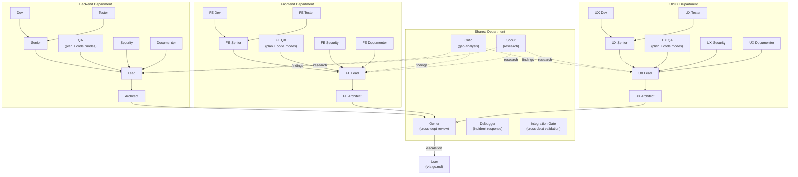

# YOLO Architecture Diagrams

Visual reference for the YOLO engine architecture. All diagrams use Mermaid syntax for GitHub-native rendering.

Last Updated: 2026-02-19

---

## Diagram 1: Agent Hierarchy

**Source files:** `agents/yolo-*.md`, `references/company-hierarchy.md`, `references/departments/*.toon`

**Notes:**
- Solid arrows = escalation chain (Dev -> Senior -> Lead -> Architect -> Owner -> User)
- Dotted arrows = advisory (Critic/Scout findings flow to Leads)
- QA is a single agent with plan and code modes (merged from QA Lead + QA Code)
- Each department has 8 agents; Shared has 5 agents
- Single-dept mode uses Backend only; multi-dept adds Frontend and/or UI/UX via config

---
