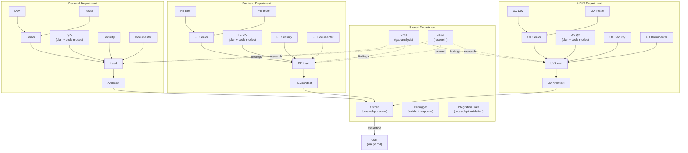
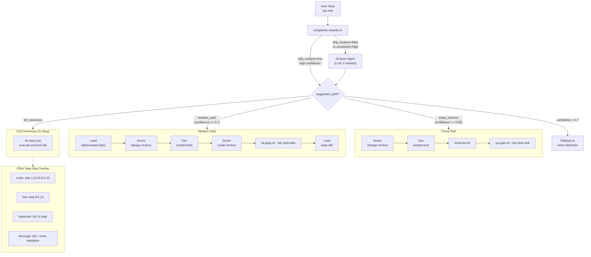

# YOLO Architecture Diagrams

Visual reference for the YOLO engine architecture. All diagrams use Mermaid syntax for GitHub-native rendering.

Last Updated: 2026-02-19

---

## Diagram 1: Agent Hierarchy

**Source files:** `agents/yolo-*.md`, `references/company-hierarchy.md`, `references/departments/*.toon`

**Notes:**
- Solid arrows = escalation chain (Dev -> Senior -> Lead -> Architect -> Owner -> User)
- Dotted arrows = advisory (Critic/Scout findings flow to Leads)
- QA is a single agent with plan and code modes (merged from QA Lead + QA Code)
- Each department has 8 agents; Shared has 5 agents
- Single-dept mode uses Backend only; multi-dept adds Frontend and/or UI/UX via config

---

## Diagram 2: Workflow Steps & Data Flow

```mermaid
flowchart LR
    subgraph PO_Layer["PO Layer (optional)"]
        PO["PO Agent"]
        Quest["Questionary"]
        Road["Roadmap"]
        PO --> Quest
        Quest --> PO
        PO --> Road
    end

    subgraph Planning["Planning Phase"]
        S1["Step 1<br/>Critic"]
        S2["Step 2<br/>Scout"]
        S3["Step 3<br/>Architect"]
        S4["Step 4<br/>Lead (plan)"]
    end

    subgraph Execution["Execution Phase"]
        S5["Step 5<br/>Senior<br/>(design review)"]
        S6["Step 6<br/>Tester<br/>(RED)"]
        S7["Step 7<br/>Dev<br/>(implement)"]
        S8["Step 8<br/>Senior<br/>(code review)"]
    end

    subgraph Quality["Quality Phase"]
        S85["Step 8.5<br/>Documenter<br/>(optional)"]
        S9["Step 9<br/>QA"]
        S10["Step 10<br/>Security"]
        S11["Step 11<br/>Lead<br/>(sign-off)"]
    end

    PO -->|"scope-document.json"| S1
    S1 -->|"critique.jsonl"| S2
    S2 -->|"research.jsonl"| S3
    S3 -->|"architecture.toon"| S4
    S4 -->|"plan.jsonl"| S5
    S5 -->|"enriched plan<br/>(spec + ts)"| S6
    S6 -->|"test-plan.jsonl<br/>+ test files"| S7
    S7 -->|"summary.jsonl<br/>+ test-results.jsonl"| S8
    S8 -->|"code-review.jsonl"| S85
    S85 -->|"docs.jsonl"| S9
    S8 -->|"code-review.jsonl"| S9
    S9 -->|"verification.jsonl"| S10
    S10 -->|"security-audit.jsonl"| S11

    S11 -->|"state complete"| Done{{"Phase Complete"}}
```

**Source files:** `references/execute-protocol.md`, `references/company-hierarchy.md`, `references/artifact-formats.md`

**Artifact legend:**
| Artifact | Format | Produced by | Consumed by |
|----------|--------|-------------|-------------|
| `scope-document.json` | JSON | PO | Critic, Architect, Lead |
| `critique.jsonl` | JSONL | Critic | Scout, Architect |
| `research.jsonl` | JSONL | Scout | Architect |
| `architecture.toon` | TOON | Architect | Lead, Senior |
| `plan.jsonl` | JSONL | Lead | Senior, Tester, Dev, QA |
| `test-plan.jsonl` | JSONL | Tester | Dev, QA |
| `test-results.jsonl` | JSONL | Dev | QA, Senior |
| `summary.jsonl` | JSONL | Dev (task) / Lead (teammate) | Senior, QA, Security |
| `code-review.jsonl` | JSONL | Senior | QA, Documenter |
| `docs.jsonl` | JSONL | Documenter | (additive, non-blocking) |
| `verification.jsonl` | JSONL | QA | Security, Lead |
| `security-audit.jsonl` | JSONL | Security | Lead |

---

## Diagram 3: Complexity Routing

**Source files:** `commands/go.md` (Path 0), `scripts/complexity-classify.sh`, `scripts/route.sh`, `references/effort-profile-*.toon`

**Routing rules:**
- Shell classifier runs first; skips Analyze agent when confidence is high enough
- Trivial: Senior + Dev only, no formal planning, no QA agents, no security
- Medium: Lead + Senior + Dev + code review, post-plan QA gate only
- High: Full 11-step ceremony with all agents
- Effort level is orthogonal to complexity: turbo effort on high complexity still runs full ceremony but skips steps 1, 2, 6, 8.5, 9, 10

---

## Diagram 4: Hook System & Scripts

```mermaid
flowchart TD
    subgraph Hooks["Hook Lifecycle"]
        direction TB
        SS["SessionStart"]
        PTU_Pre["PreToolUse"]
        PTU_Post["PostToolUse"]
        SAS["SubagentStart"]
        SAStop["SubagentStop"]
        UPS["UserPromptSubmit"]
        PC["PreCompact"]
        Notif["Notification"]
        Stop["Stop"]
    end

    HW["hook-wrapper.sh<br/>(central router)"]

    SS --> HW
    PTU_Pre --> HW
    PTU_Post --> HW
    SAS --> HW
    SAStop --> HW
    UPS --> HW
    PC --> HW
    Notif --> HW
    Stop --> HW

    subgraph SessionScripts["Session Scripts"]
        S_Start["session-start.sh"]
        S_Stop["session-stop.sh"]
        S_Map["map-staleness.sh"]
        S_Tpl["template-staleness-check.sh"]
        S_Compact["post-compact.sh"]
        S_CompInst["compaction-instructions.sh"]
    end

    subgraph GuardScripts["Guard Scripts"]
        G_Block["block-plan-mode.sh"]
        G_Sec["security-filter.sh"]
        G_File["file-guard.sh"]
        G_Dept["department-guard.sh"]
        G_DeptSpawn["validate-dept-spawn.sh"]
    end

    subgraph ValidationScripts["Validation Scripts"]
        V_Commit["validate-commit.sh"]
        V_Summary["validate-summary.sh"]
        V_Front["validate-frontmatter.sh"]
        V_Validate["validate.sh --type<br/>(plan|naming|config|gates|deps|summary|frontmatter)"]
        V_Send["validate-send-message.sh"]
    end

    subgraph AgentScripts["Agent Lifecycle"]
        A_Start["agent-start.sh"]
        A_Stop["agent-stop.sh"]
        A_Template["template-generate-hook.sh<br/>-> generate-agent.sh"]
    end

    subgraph OrchestratorScripts["Orchestrator Scripts (go.md)"]
        O_Phase["phase-detect.sh"]
        O_Compile["compile-context.sh<br/>-> filter-agent-context.sh"]
        O_Route["route.sh<br/>--path trivial|medium|high"]
        O_QAGate["qa-gate.sh<br/>--tier post-task|post-plan|post-phase"]
        O_Classify["complexity-classify.sh"]
        O_Resolve["resolve-agent-model.sh"]
        O_Team["resolve-team-mode.sh"]
        O_Depts["resolve-departments.sh"]
        O_Critique["critique-loop.sh"]
        O_Review["review-loop.sh"]
        O_Exec["generate-execution-state.sh"]
    end

    HW --> SessionScripts
    HW --> GuardScripts
    HW --> ValidationScripts
    HW --> AgentScripts

    GoMD["go.md<br/>(orchestrator)"] --> O_Phase
    GoMD --> O_Compile
    GoMD --> O_Route
    GoMD --> O_QAGate
    GoMD --> O_Classify
    GoMD --> O_Resolve
    GoMD --> O_Team
    GoMD --> O_Depts
    GoMD --> O_Critique
    GoMD --> O_Review
    GoMD --> O_Exec

    HW --> Notif_QA["qa-gate.sh<br/>(Notification hook)"]
    HW --> TaskV["task-verify.sh"]
    HW --> SkillD["skill-hook-dispatch.sh"]
    HW --> StateU["state-updater.sh"]
    HW --> Preflight["prompt-preflight.sh"]
```

**Source files:** `hooks/hooks.json`, `scripts/hook-wrapper.sh`, `commands/go.md`

**Hook dispatch rules:**
| Hook Event | Scripts Triggered | Matcher |
|------------|------------------|---------|
| SessionStart | session-start.sh, map-staleness.sh, template-staleness-check.sh, post-compact.sh (on compact) | (all) |
| PreToolUse | block-plan-mode.sh, security-filter.sh, file-guard.sh, department-guard.sh, skill-hook-dispatch.sh | Write\|Edit, Read\|Glob\|Grep, EnterPlanMode |
| PostToolUse | validate-summary.sh, validate-frontmatter.sh, validate-commit.sh, state-updater.sh, skill-hook-dispatch.sh, validate-send-message.sh, task-verify.sh | Write\|Edit, Bash, SendMessage, TaskUpdate |
| SubagentStart | validate-dept-spawn.sh, template-generate-hook.sh, agent-start.sh | yolo-* |
| SubagentStop | validate-summary.sh, agent-stop.sh | yolo-* |
| Notification | notification-log.sh, qa-gate.sh | (all) |
| PreCompact | compaction-instructions.sh | (all) |
| Stop | session-stop.sh | (all) |
| UserPromptSubmit | prompt-preflight.sh | (all) |

**Consolidated scripts (Phase 9):**
- `scripts/route.sh` replaces route-trivial.sh, route-medium.sh, route-high.sh
- `scripts/validate.sh` replaces validate-plan.sh, validate-naming.sh, validate-config.sh, validate-gates.sh, validate-deps.sh
- `scripts/qa-gate.sh` replaces qa-gate-post-task.sh, qa-gate-post-plan.sh, qa-gate-post-phase.sh

---
